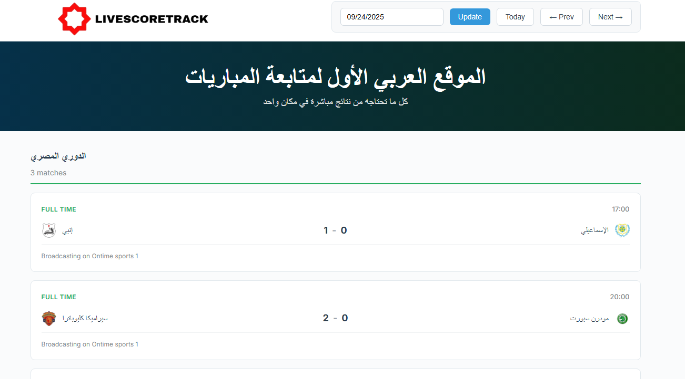

# ⚽  Live Football Matches Scores Scraping
<p align="center">
  
</p>

A Django-based web application that scrapes football match data from **Yallakora** and displays it in a clean, structured interface.  
It groups matches by league, shows kickoff time, team logos, scores, broadcasting channel, and automatically highlights the match status (Live, Finished, or Upcoming).

---

## 🚀 Features
- Scrape matches by date (via query string: `?date=MM/DD/YYYY`)
- Display matches grouped by **league**
- Show **teams, logos, kickoff time, scores**
- Auto-computed **match status** (Live / Full Time / Upcoming)
- Lightweight and responsive UI
- JSON dump of raw scraped data for debugging

---

## 🛠️ Tech Stack
- **Backend:** Django 5.x, Python 3.12+
- **Frontend:** HTML, CSS, Vanilla JS
- **Scraping:** `requests` + `BeautifulSoup`

---

## 📂 Project Structure
yallakora_scraper/
│── matches/
│ ├── templates/matches/home.html # Main UI
│ ├── views.py # Core logic (normalization, grouping)
│ ├── scraper.py # Scraping functions
│ ├── urls.py # App routes
│ └── ...
│
├── yallakora_scraper/
│ ├── settings.py
│ ├── urls.py
│ └── ...
│
├── manage.py
└── README.md

---

## ⚙️ Installation & Setup

### 1. Clone the repository
```bash
git clone https://github.com/yourusername/Football_scores_scraper.git
cd Football_scores_scraper
```

### 2. Create & activate virtual environment

```
python -m venv venv
source venv/bin/activate   # On Linux/Mac
venv\Scripts\activate      # On Windows
```
### 3. Install dependencies
```
pip install -r requirements.txt
```

### 4. Run migrations
```
python manage.py migrate
```

### 5. Start development server
```
python manage.py runserver
```

Then open: 👉 ```http://127.0.0.1:8000/```

📸 Screenshots
<p align="center">
  
</p>

🤝 Contribution

Feel free to fork this repo, make changes, and submit a pull request.
Bug reports and feature requests are welcome in the Issues section.
